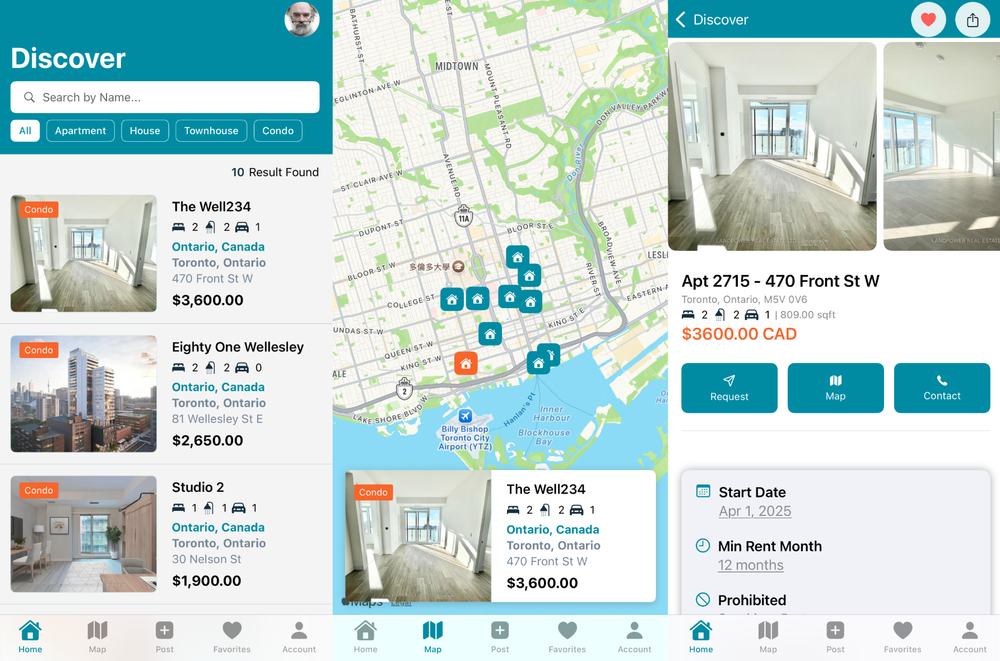

# 4Rent
## Introduction
[Quick Demo](https://youtu.be/sNjayM3uNhA)
- This is a iOS application utilizing `Swift(SwiftUI)`, `Firebase`, `Apple Map` to facilitate property rental management, including listing properties, managing requests between landlords and tenants, handling favorites, and integrating map functionalities.

- The app helps landlords manage their listed properties and rental requests, while enabling tenants to discover, request, and favorite properties. It integrates Firebase for backend management and `SwiftUI` for a seamless user interface.

<div align="center">
    
</div>

## Features
- `(CRUD)`Property Listing & Management 
- Favorites Management
- Tenant Requests Handling (approve/reject requests)
- Map Integration for property location visualization
- Interactive UI with intuitive UX and dynamic states

## **Project Structure**
```
Project
│
├── Constants   # Immutable Value
│   └── ...
├── Controllers # Viewmodel connects with database
│   └── ...
├── Helpers     # Fuction for valitdating
│   └── ...
├── Hooks       
│   └── ...
├── Images
│   └── ...
├── Models      # Enum, Collection
│   └── ...
├── Views       # Frontend view
    ├── ...
    ├── Shared  # component
    │   └── ...
    └── ...
```

---

## **Database Schema**
### **Profile Collection**
| Field              | Description                        | Type                |
|--------------------|------------------------------------|---------------------|
| id                 | User unique identifier (UID)       | String              |
| displayName        | User's display name                | String              |
| phoneNumber        | User phone number                  | String (Optional)   |
| photoURL           | Profile picture URL                | String (Optional)   |

---


### **Favorite Collection**

| Field       | Description              | Type              |
|-------------|-------------------------|-------------------|
| userID      | Tenant's user ID         | String            |
| propertyID  | Favorited property ID    | String            |
| timestamp   | Favorite action timestamp | Date              |

---

### **Request Collection**

| Field            | Description                                  | Type                |
|------------------|----------------------------------------------|---------------------|
| LandlordID       | Landlord's user ID                           | String              |
| TenantID         | Tenant's user ID                             | String              |
| PropertyID       | Associated property ID                        | String              |
| Status           | Request status (Pending, Approved, Rejected) | Enum                |
| AppointmentDate  | Scheduled appointment date                   | Date (Optional)     |
| createAt         | Creation timestamp                           | Date                |

---

### **Property Collection**
| Field              | Description                                | Type                                    |
|--------------------|--------------------------------------------|-----------------------------------------|
| id                 | Unique identifier                           | String                              |
| address1           | Primary address line                        | String                                |
| address2           | unit number        | String (Optional)                     |
| city              | City                                        | String                                |
| province          | Province/State                              | String                                |
| country           | Country                                     | String                                |
| postalCode        | Postal Code                                 | String                                |
| startDate         | Available from date                         | Date                                  |
| minRentMonth      | Minimum rental duration (months)            | Int                                   |
| price             | Price of property                           | Double                                |
| propertyType      | Type of property                            | Enum (Apartment, House, Condo, etc.) |
| bedroom           | Number of bedrooms                          | Int                                   |
| bathroom          | Number of bathrooms                         | Int                                   |
| parking           | Number of parking spaces                    | Int                                   |
| sqft              | Property size in sqft                       | Double                                |
| amenities         | Amenities included                          | [String] (Optional)                  |
| prohibited        | Prohibited items                            | [String] (Optional)                  |
| included          | Included items                              | [String] (Optional)                  |
| gender            | Gender restrictions                         | String (Optional)                    |
| exposure          | Orientation (e.g., South, East)             | String (Optional)                    |
| description       | Property description                        | String (Optional)                    |
| latitude          | Latitude coordinate                         | Double (Optional)                    |
| longitude         | Longitude coordinate                        | Double (Optional)                    |
| createAt          | Property creation timestamp                 | Date                                  |
| contactID         | Landlord’s user ID                          | String                                |
| pictureURL        | URLs of property images                     | [String] (Optional)                  |
| communityName     | Community name                              | String (Optional)                    |
| area              | Area or neighborhood                        | String (Optional)                    |
| logUser           | Last modified by (user ID)                  | String (Optional)                    |
| logDate           | Last modification timestamp                 | Date (Optional)                      |

---
