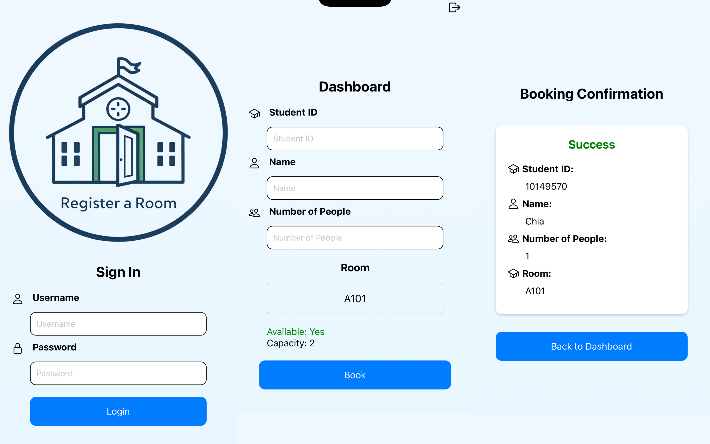

# Mobile Room Booking App
- [Video](https://youtube.com/shorts/OOI7flT5zHg)
- [Quick Demo](https://youtube.com/shorts/OOI7flT5zHg)
- This is a cross-platform mobile application built with **React Native** and **Expo**. The app demonstrates multi-screen functionality with user authentication, room booking, and real-time capacity updates.

    

## Features

- **User Authentication**: 
  - Sign in using case-insensitive credentials (username and password are both **admin**).
- **Dashboard**:
  - Input fields for Student ID, Name, and Number of People.
  - A custom dropdown component for room selection.
  - Displays current room capacity and availability.
  - Validates booking conditions before proceeding.
  - Custom logout button positioned at the top right.
- **Booking Confirmation**:
  - Displays booking details and a success message.
  - Deducts the booked number of people from the room’s capacity.
  - Resets the navigation stack to prevent going back to the booking screen.

