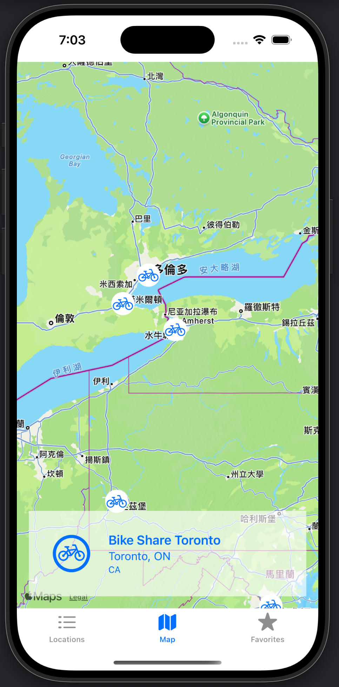

# City Bike Explorer
## Introduction
[Quick Demo](https://youtu.be/sSgPvKERUy8)
Using Swift, Firebase, API, Apple Map. City Bike Explorer is an iOS application built with SwiftUI that displays city bike networks around the world. Users can view a list of networks, see their locations on a map, and view detailed information.

<div align="center">
    
</div>

## Guide
- **City Bike List:** Browse a list of city bike networks fetched from the CityBik API. Supports search by city name.
- **Map View:** Display all networks on a map (centered on Toronto by default). Tap on a map annotation to view detailed info.
- **Detail View:** See detailed information of a selected network including location, company, and a map view. Toggle favorites directly from the detail screen.
- **Favorite List:** Manage your favorite networks. Supports multi-selection, batch deletion with confirmation, and search functionality.


## Project Structure

The project is modularized into several components:

- **Models.swift:**  
  Contains the data models (`DataField`, `Location`, and `DataFields`) representing the API data structure.

- **APIController.swift:**  
  Responsible for fetching data from the CityBike API using Alamofire and decoding JSON into model objects.

- **DBController.swift:**  
  Handles CRUD operations (add, fetch, delete) with Firebase Firestore for favorite networks.

- **BikeListView.swift:**  
  Displays a searchable list of city bike networks. Each item navigates to the detail view.

- **BikeMapView.swift:**  
  Shows a map view with annotations for all networks. Tapping an annotation displays a card view to access details.

- **BikeDetailView.swift:**  
  Presents detailed information for a selected network, including a map, formatted network details, and a favorite toggle button in the navigation bar.

- **FavoriteListView.swift:**  
  Displays the list of favorite networks stored in Firebase with support for search, swipe-to-delete, and batch deletion in edit mode.

# Data Fields
## API Source
- [API Introduction](https://api.citybik.es/v2/?ref=public_apis)
- [API Data](https://api.citybik.es/v2/networks)

## JSON Field & Model in Swift
- **DataField.swift**  
  - `id`: Unique identifier for the network.  
  - `name`: Name of the network.  
  - `location`: A `Location` object containing:
    - `latitude`: Latitude coordinate.
    - `longitude`: Longitude coordinate.
    - `city`: City name.
    - `country`: Country code.
  - `href`: API link to the network.
  - `company`: An array of companies associated with the network.
  - `gbfs_href`: Optional link for GBFS data.
```Json
{
  "networks": [
    {
      "id": "abu-dhabi-careem-bike",
      "name": "Abu Dhabi Careem BIKE",
      "location": {
        "latitude": 24.4866,
        "longitude": 54.3728,
        "city": "Abu Dhabi",
        "country": "AE"
      },
      "href": "/v2/networks/abu-dhabi-careem-bike",
      "company": [
        "Careem"
      ],
      "gbfs_href": "https://dubai.publicbikesystem.net/customer/gbfs/v2/en/gbfs.json"
    },
    {
      "id": "acces-velo-saguenay",
      "name": "Accès Vélo",
      "location": {
        "latitude": 48.433333,
        "longitude": -71.083333,
        "city": "Saguenay",
        "country": "CA"
      },
      "href": "/v2/networks/acces-velo-saguenay",
      "company": [
        "PBSC Urban Solutions"
      ],
      "gbfs_href": "https://saguenay.publicbikesystem.net/customer/gbfs/v2/gbfs.json"
    },
    {
      "id": "aksu",
      "name": "Aksu",
      "location": {
        "latitude": 41.1664,
        "longitude": 80.2617,
        "city": "阿克苏市 (Aksu City)",
        "country": "CN"
      },
      "href": "/v2/networks/aksu",
      "company": [
        "阿克苏公共服务"
      ]
    },
}
```