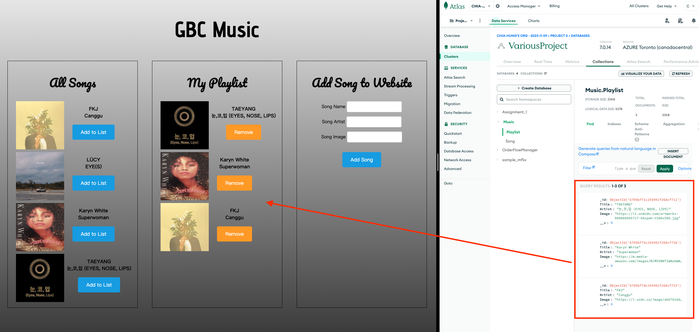

# OrderFlowManager
<div align="center">
    
</div>
## Introduction
Add the songs like Spotify. Using EJS, Node.js, MongoDB.

## Features
- Basic RESTful API demonstration. 
- EJS, MongoDB


## Quick Start

1. Set up environment variables:
   - Create a `.env` file in the project root.
   - Add the following environment variables:
     ```
     DB_USER=MongodbUser
     DB_PASSWORD=DB password
     DB_NAME=DB Name
     DB_USE=Music
     DB_DEFAULT_PORT=3005
     ```

3. Make sure MongoDB is running (either locally or via MongoDB Atlas).

4.  Running the Project. Make sure can run the server and unit testing:
    ```bash
    cd server
    npm test
    crtl+C
    npm start
    ```

5. The server will run at `http://localhost:3005`. You can use a tool like `Postman` to interact with the API.

6. Enjoy!


